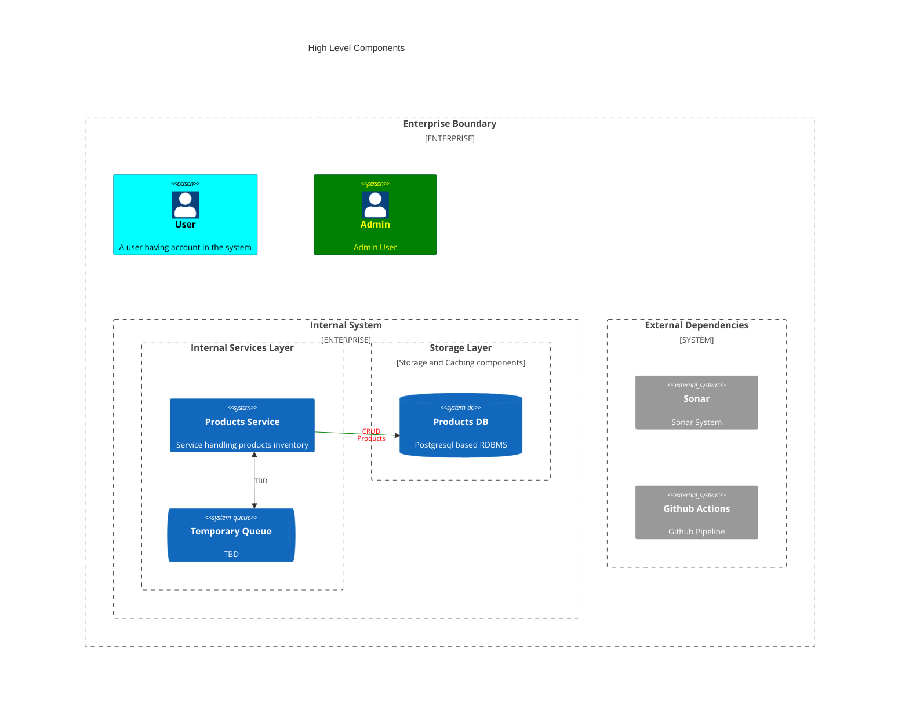

# kotlin-web
Sample Product CRUD repository.

## Experimentation/ Sample Design:
- Kotlin :heavy_check_mark: 
- Spring Boot Blocking :heavy_check_mark: 
- Postgres :heavy_check_mark: 
- DB data viewer :heavy_check_mark:
- Docker-Compose :heavy_check_mark:
- OpenAPI: Server stub generation :heavy_check_mark:
- OpenAPI: Blocking Client stub geenration(Feign)  
- Micrometer
- Prometheus
- Grafana to pull data from metrices
- DAO Layer
    - Flyway : Migrations :heavy_check_mark:
    - Jooq : Dao :heavy_check_mark:
        - Jooq task generation :heavy_check_mark:
        - DB Context switching
- Auth layer(Service discovery or one-to-one auth)
    - Client Authentication with API-KEY & Secret
    - Auto key Rotation
    - Rate limit based on API-KEY
- Sample blocking client
- Spring Boot Reactive
- Sample non-blocking client.
- OpenAPI: Blocking Client stub generation(Webclient???)
- Caching with Redis
- Keycloak for User Management.(Or for client managment)
- Integration Tests
- Github pipeline
    - project build
    - setup sonar 
    - OWASP ZAP integration
- Kotlin:
    - suspend and continuation
    - 

## HLD


## Gradle
```sh
./gradlew build
-> compileKotlin
    -> tasks.ktlintFormat
    -> postGenerateCleanup
        -> generateServerStub
            -> preGenerateCleanup
```

## Notes
### Postgres
- db_url: 
- Run `Postgres` from docker-compose file.
- create .env file add values for `POSTGRES_USER`, `POSTGRES_PASSWORD`
```
psql -p 54320 -U postgres -h localhost
```
